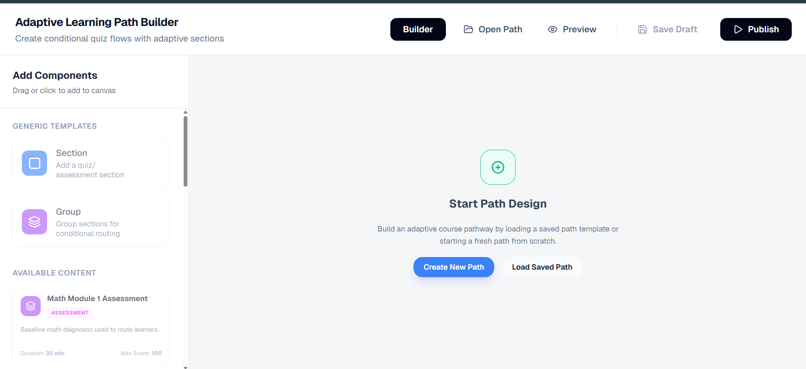
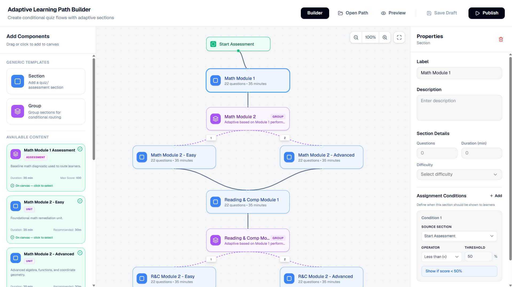

# 🚀 Adaptive Learning Path Builder

**Adaptive Learning Path Builder** is a visual, node-based platform for designing and simulating adaptive learning workflows. Educators can create dynamic learning paths where students are automatically routed to different modules based on assessment scores and conditional logic.

**Repository:** [https://github.com/Vishwanathangit/Adaptive-Learning-Path-Builder](https://github.com/Vishwanathangit/Adaptive-Learning-Path-Builder)

---

## 📚 Table of Contents

- [Features](#-features)
- [Tech Stack](#-tech-stack)
- [Project Architecture](#-project-architecture)
- [Project Structure](#-project-structure)
- [Screenshots](#-screenshots)
- [Getting Started](#-getting-started)
- [Environment Variables](#-environment-variables)
- [Running the Application](#-running-the-application)
- [Testing](#-testing)
- [API Endpoints](#-api-endpoints)
- [Future Enhancements](#-future-enhancements)
- [License](#-license)

---

## 🎯 Features

- ✅ Visual drag-and-drop learning path editor
- 🎨 Zoomable and pannable SVG canvas
- 🔀 Conditional branching based on assessment scores
- 📊 Real-time learning path simulator
- 💾 Automatic versioning of learning paths
- 📚 CRUD operations for learning paths
- 🧩 Reusable learning components
- 🚀 RESTful Spring Boot API
- 💻 Responsive UI built with Tailwind CSS
- 🌱 Auto-seeded sample adaptive learning path

---

## ⚙️ Tech Stack

### Frontend

| Technology | Version |
|------------|---------|
| React | 19.2.7 |
| TypeScript | 6.0.2 |
| Vite | 8.1.0 |
| Zustand | 5.0.14 |
| Tailwind CSS | 4.3.1 |
| shadcn/ui | 4.11.0 |
| Radix UI | 1.6.0 |
| Axios | 1.18.1 |
| Lucide React | 1.21.0 |
| clsx | 2.1.1 |
| tailwind-merge | 3.6.0 |

### Backend

| Technology | Version |
|------------|---------|
| Java | 21 |
| Spring Boot | 4.1.0 |
| Spring Data JPA | — |
| Hibernate Community Dialects | — |
| SQLite JDBC | 3.50.3.0 |
| Lombok | — |
| Jackson Databind | — |
| JUnit 5 (via spring-boot-starter-test) | — |
| MockMvc | — |

### Dev Dependencies (Frontend)

| Technology | Version |
|------------|---------|
| Vitest | 4.1.9 |
| @testing-library/react | 16.3.2 |
| @testing-library/user-event | 14.6.1 |
| @testing-library/jest-dom | 6.9.1 |
| ESLint | 10.5.0 |
| @vitejs/plugin-react | 6.0.2 |
| jsdom | 29.1.1 |

---

## 🏗️ Project Architecture

```
Frontend (React + TypeScript)
        │
   REST API (JSON)
        │
Spring Boot Backend
        │
  SQLite Database
```

---

## 📁 Project Structure

```text
Adaptive-Learning-Path-Builder/
│
├── backend/
│   ├── controller/
│   ├── entity/
│   ├── repository/
│   ├── service/
│   ├── dto/
│   ├── config/
│   ├── resources/
│   ├── src/test/
│   └── pom.xml
│
├── frontend/
│   ├── src/
│   │   ├── components/
│   │   ├── canvas/
│   │   ├── pages/
│   │   ├── store/
│   │   ├── hooks/
│   │   ├── utils/
│   │   └── types/
│   ├── public/
│   └── package.json
│
└── README.md
```

---

## 🖼️ Screenshots

Add screenshots inside a folder named `screenshots/`:

```text
screenshots/
├── builder.png    — Main Visual Learning Path Builder Canvas
└── simulator.png  — Learning Path Simulation Screen
```

### Learning Path Builder


### Path Simulator


---

## 🚀 Getting Started

### Prerequisites

| Tool | Version |
|------|---------|
| Node.js | 18+ |
| pnpm | Latest |
| Java JDK | 21+ |
| Git | Latest |

### Clone Repository

```bash
git clone https://github.com/Vishwanathangit/Adaptive-Learning-Path-Builder.git
cd Adaptive-Learning-Path-Builder
```

---

## 🌍 Environment Variables

### Backend

```env
APP_CORS_ALLOWED_ORIGINS=http://localhost:5173
```

> Default configuration works without creating an `.env` file.

---

## ▶️ Running the Application

### Backend

**macOS / Linux:**
```bash
cd backend
./mvnw spring-boot:run
```

**Windows:**
```bash
cd backend
mvnw.cmd spring-boot:run
```

Runs on: `http://localhost:8080`

### Frontend

```bash
cd frontend
pnpm install
pnpm dev
```

Runs on: `http://localhost:5173`

---

## 🧪 Running Tests

### Backend

```bash
cd backend
./mvnw test
```

### Frontend

```bash
cd frontend
pnpm test
```

---

## 📡 API Endpoints

### Base URL

```
http://localhost:8080/api
```

---

### 📦 Components

| Method | Endpoint | Description |
|--------|----------|-------------|
| `GET` | `/components` | Get all available learning components |

---

### 🛣️ Learning Paths

| Method | Endpoint | Description |
|--------|----------|-------------|
| `GET` | `/learning-paths` | Get all learning paths |
| `GET` | `/learning-paths/{id}` | Get a learning path by ID |
| `POST` | `/learning-paths` | Create or update a learning path |
| `DELETE` | `/learning-paths/{id}` | Delete a learning path |

---

### 🧠 Evaluation Engine

| Method | Endpoint | Description |
|--------|----------|-------------|
| `POST` | `/learning-paths/{id}/evaluate` | Evaluate conditions and return the next node |

---

## 💡 Core Functionalities

- Visual node editor
- Assessment-based routing
- Dynamic branching
- Path simulation
- Version control
- Auto-seeded demo data
- Responsive interface
- SQLite persistence

---

## 🚀 Future Enhancements

- Authentication & Role Management
- Collaborative Editing
- Analytics Dashboard
- Learning Progress Tracking
- Export / Import JSON
- Multiple Assessment Types
- AI-generated Learning Paths

---

## 📄 License

MIT License

---

Made with ❤️ using React, Spring Boot, and TypeScript.
